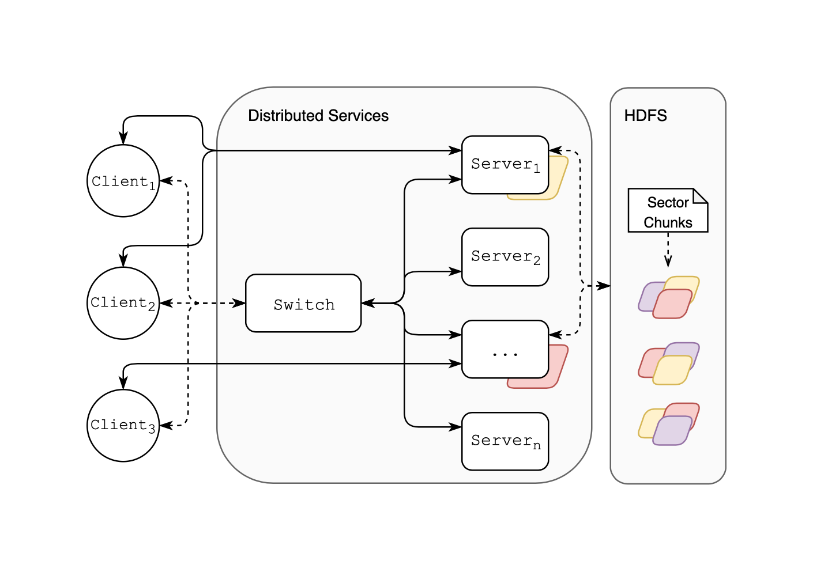

# Area Mapping in Voluminous Virtual Environments

To improve the efforts of game development we design a balanced and scalable cloud architecture for isolated users to interact with in an extraordinarily large and shared virtual environment. We improve the scalability for server architectures by implementing both spatial subdivisions and dynamic replication of data based on user load.

This architecture will be broken into four components, including; (a) a Client application for moving within the environment, (b) Application Servers for simulating the render of a client's environment, (c) a Control Switch to oversee the control flow, and (d) a distributed file system to effectively manage the data composing the application.

Our paper can be found [ [here](.) ]

### Contributors

Jason D. Stock - stock@colostate.edu - [stockeh](https://github.com/stockeh)  
Evan Steiner - evanjs@colostate.edu - [evanjs97](https://github.com/evanjs97)  
William Pickard - wpickard@colostate.edu - [WilliamPickard](https://github.com/WilliamPickard)
